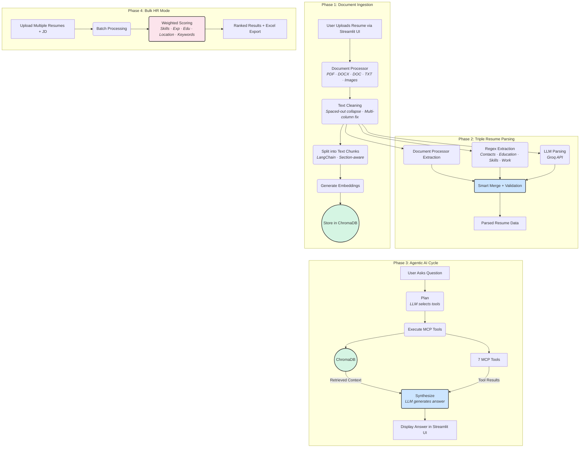

# 🤖 Universal AI Resume Assistant

An intelligent, agentic AI-powered resume chatbot that can parse, analyze, and answer questions about any resume using **Agentic RAG** (Retrieval-Augmented Generation) and **MCP** (Model Context Protocol) tools. Includes an **Enterprise HR Bulk Mode** for comparing multiple resumes against a single Job Description with ranked scoring.


---

### Project Architecture




## ✨ Features
Core Features
- 📄 Universal Document Processing — PDF, DOCX, DOC (legacy Word 97-2003), TXT, and Images (JPG, PNG, WEBP)
- 🧠 Agentic AI Architecture — Plan → Execute → Synthesize workflow with model fallback chain
- 🔧 7 MCP Tools — Specialized tools for different resume analysis tasks
- 🔍 RAG-Powered Search — Section-aware semantic search through resume content via ChromaDB
- 📊 Skill Gap Analysis — Compare candidate skills against job requirements
- 🎯 JD Matching — Weighted scoring of resume fit against job descriptions
- 🎓 Education Extraction — Validated, deduplicated education and certification analysis
- 📝 Content Generation — Cover letters, LinkedIn summaries, and professional bios
- 👁️ Full-Screen Preview — View uploaded resumes with download option
- 🌙 Dark Mode UI — Modern, responsive interface with custom theme

## Enterprise HR — Bulk Resume Mode
- 📚 Multi-Resume Upload — Process up to 50 resumes at once
- 📋 JD-Based Comparison — All resumes scored against a single Job Description
- 🏆 Ranked Results — Candidates ranked by weighted overall score
- 📊 5-Sheet Excel Export — Rankings, Detailed Info, JD Requirements, Summary, Failed Files
- 📄 CSV & JSON Export — For integration with HR systems
- 🔢 Weighted Scoring — Skills (35%), Experience (25%), Education (15%), Location (10%), Keywords (15%)
- 🟢🟡🟠🔴⚫ Recommendation Tiers — Excellent (≥80%) → Low (<35%)

## Enhanced Resume Parser (V11)
- 🔄 Triple Extraction Pipeline — Document Processor + Regex + LLM, smart-merged
- 👤 8-Strategy Name Extraction — Labeled names, Initial.Name format (M.SREEKANTH), ALL-CAPS, Regards/Declaration sections, email-derived, and more
- 🎓 Education Cross-Validation — Validates extracted education against original resume text; rejects awards, company names, fragments, and repetitions
- 📍 400+ Known Locations — Positive location verification against cities, states, and countries worldwide
- 📧 Email PIN-Prefix Cleaning — Strips leading ZIP/PIN code digits from email local parts
- 🌐 Portfolio URL Validation — Rejects employer domains and mangled URLs
- 🏢 Strict Work Entry Validation — Rejects sentences, descriptions, and bullet text as job titles
- 📅 Independent Experience Calculation — Recalculates from dates; NEVER trusts LLM totals (current year: 2026)
- 🔤 Spaced-Out Text Detection — Collapses S A N K E T → SANKET
- 🧹 Section-Aware Extraction — Prevents date/text leaks between resume sections
- 🏷️ Labeled Format Parsing — Handles Role:, Company:, Duration: structured formats
- 🔗 Narrative Pattern Matching — Extracts work history from paragraph-format descriptions (e.g., "Currently working as X with Y since DATE")

## 🔧 MCP Tools

#	Tool	                    Description
- 1	📄 resume_search - RAG-powered semantic search with section-aware chunking (ChromaDB)
- 2	📊 skill_analyzer - Extract, categorize, and optionally match skills against requirements
- 3	💼 experience_calculator - Calculate total experience with timeline breakdown (as of 2026)
- 4	📝 cover_letter_generator - Generate tailored cover letter data from resume
- 5	👤 profile_summary - Extract profile, contact info, and create professional summaries
- 6	🎯 jd_matcher - Weighted scoring of resume vs Job Description (requires JD upload)
- 7	🎓 education_extractor - Extract validated, deduplicated education and certifications

## 📁 Project Structure


## 🚀 Quick Start

### Prerequisites
- Python 3.11+
- Groq API Key (free at [console.groq.com](https://console.groq.com/keys))

### Installation
1. **Clone the repository**
   ```bash
   git clone https://github.com/VijaiVenkatesan/Agentic_AI_Resume_Chatbot.git
   cd Agentic_AI_Resume_Chatbot
2. Install system dependencies (Linux/macOS — needed for legacy .doc support)
   sudo apt-get install build-essential python3-dev antiword catdoc
3. Install dependencies
   pip install -r requirements.txt
4. Set up environment variables
   export GROQ_API_KEY="your-groq-api-key"
6. Run the application
   streamlit run streamlit_app.py
7. Open in browser
   http://localhost:8501
   
## ☁️ Deploy to Streamlit Cloud
1. Push to GitHub:
   - git add .
   - git commit -m "Initial commit"
   - git push origin main
   
3. Deploy on Streamlit Cloud:
   - Go to https://share.streamlit.io/
   - Connect your GitHub repository
   - Set main file to streamlit_app.py
   - Add GROQ_API_KEY in Secrets:
   GROQ_API_KEY = "your-groq-api-key"
   
- Deploy!
- "Note: The packages.txt file automatically installs system dependencies (antiword, catdoc, build-essential, python3-dev) on Streamlit Cloud."

## 🎯 Usage Examples

## Single Resume Mode

Basic Questions
- "What is the candidate's contact information?"
- "List all technical skills"
- "What is the educational background?"
- "Calculate total years of experience"

Skill Analysis
- "Match skills: Python, AWS, Docker, Kubernetes"
- "What are the key technical competencies?"
- "Identify skill gaps for a Senior Engineer role"

Content Generation
- "Write a cover letter for Software Engineer at Google"
- "Generate a LinkedIn summary"
- "Create an elevator pitch"

JD Matching (with uploaded JD)
- "Compare this resume against the job description"
- "How well does this candidate fit the JD?"
- "What are the strengths and gaps?"

## Bulk Resume Mode (HR)

- 1. 📋 Upload a Job Description (required)
- 2. 📤 Upload multiple resumes (up to 50 files)
- 3. 🚀 Click "Process & Compare All Resumes"
- 4. 📊 View ranked results with filter tabs (Excellent / Good / Moderate)
- 5. 📥 Export to Excel (5-sheet report), CSV, or JSON

## 🔑 Supported AI Models

Model	Speed	Quality	Best For
- Llama 3.1 8B	⚡⚡ Fast	⭐⭐⭐⭐	Quick queries
- Llama 3.3 70B	🔄 Medium	⭐⭐⭐⭐⭐	Complex analysis
- Llama 4 Scout	⚡ Fast	⭐⭐⭐⭐	Vision/OCR
- Qwen 3 32B	⚡ Fast	⭐⭐⭐⭐⭐	Detailed parsing
- Kimi K2	🔄 Medium	⭐⭐⭐⭐⭐	Deep reasoning
- GPT-OSS 120B	🔄 Medium	⭐⭐⭐⭐⭐	Highest quality
- GPT-OSS 20B	⚡ Fast	⭐⭐⭐⭐	Fast + capable
- All models are accessed via Groq for lightning-fast inference.

## 📊 How It Works

# 1. Document Processing
Upload → Detect Type → Extract Text → Clean & Structure
- PDF: PyPDF2 extraction with multi-column reconstruction, spaced-out text collapsing, and layout mode fallback
- DOCX: python-docx with headers, footers, text boxes, tables, and style-aware formatting
- DOC: 6-method fallback chain (python-docx → antiword → catdoc → olefile → binary extraction → textract)
- Images: Groq Vision API (llama-4-scout-17b-16e-instruct) with detailed OCR prompt
- TXT: Multi-encoding detection (UTF-8, Latin-1, CP1252, UTF-16, etc.)

# 2. Resume Parsing
Raw Text → Document Processor + Regex + LLM → Smart Merge → Validated Result
- Document Processor extracts contacts and name from raw text
- Regex patterns extract contacts, education, skills, and work experience
- LLM (Groq API) extracts structured JSON with all fields
- Smart Merge combines all three sources, preferring the most reliable value per field
- Validation filters garbage entries (awards as education, sentences as job titles, etc.)
- Education cross-validation verifies extracted degrees exist in the original resume text

# 3. Agentic Processing
Question → Plan (LLM) → Execute (MCP Tools) → Synthesize (LLM)
- Planning: LLM analyzes question and selects appropriate tools (JSON output)
- Execution: Tools retrieve/analyze data from parsed resume and ChromaDB
- Synthesis: LLM creates human-readable response with strict no-hallucination rules
- Fallback: Deterministic keyword-based tool selection if LLM planning fails
- JD Gating: JD comparison tools only activated when a JD is actually uploaded

# 4. RAG Search
Query → Section Detection → Embedding → Vector Search → Relevant Chunks → Context
- Resume chunked into sections (400 chars, 150 overlap) with section-aware splitting
- ChromaDB stores embeddings with section metadata
- Semantic search with section boost (+0.2 relevance for matching sections)
- Direct section content retrieval as additional context

# 5. Bulk HR Processing
JD + Resumes → Parse All → Score Each → Rank → Export
- Each resume processed through the full triple extraction pipeline
- Weighted scoring: Skills (35%), Experience (25%), Education (15%), Location (10%), Keywords (15%)
- Skill matching with alias resolution (e.g., "javascript" ↔ "js", "kubernetes" ↔ "k8s")
- 5-sheet Excel export: Rankings, Detailed Candidate Info, JD Requirements, Summary, Failed Files

## 📈 Performance


## 🐛 Troubleshooting

Common Issues
# 1. "Resume not loaded" error
- Ensure file is uploaded successfully
- Check file format is supported (PDF, DOCX, DOC, TXT, JPG, PNG, WEBP)
- Verify file is not corrupted or password-protected

# 2. Education not extracted correctly
- The system uses triple extraction (Document Processor + Regex + LLM)
- Entries that look like awards, company names, or fragments are rejected
- Check if the education section is clearly formatted in the resume

# 3. Legacy .doc files not working
- Ensure antiword and catdoc are installed: sudo apt-get install antiword catdoc
- On Streamlit Cloud, these are installed automatically via packages.txt
- If all methods fail, convert the file to .docx or .pdf

# 4. API errors
- Verify GROQ_API_KEY is set correctly
- Check API rate limits (the system auto-retries with model fallback)
- Try a different model from the sidebar dropdown
  
# 5. Preview not working
- PDF/DOCX preview shows extracted text (not embedded viewer)
- Images display inline with base64 encoding
- Use Download button for original file

# 6. Bulk mode not scoring
- A Job Description must be uploaded before processing
- Ensure the JD has sufficient content (>50 characters)
- Check that resume files are not corrupted

## 🤝 Contributing

1. Fork the repository
2. Create feature branch (git checkout -b feature/amazing)
3. Commit changes (git commit -m 'Add amazing feature')
4. Push to branch (git push origin feature/amazing)
5. Open a Pull Request

## 🙏 Acknowledgments

- Groq - Lightning-fast LLM inference

- Streamlit - Web framework for ML apps

- ChromaDB - Vector database for RAG

- LangChain - Text splitting utilities

- PyPDF2 - PDF text extraction

- python-docx - DOCX processing

## 📧 Contact

Author: V Vijai

Email: vijaibt1@gmail.com

LinkedIn: https://www.linkedin.com/in/vijai-v-2b89841a3/

Profile: https://vijai-venkatesan-github-io.vercel.app/

GitHub: https://github.com/VijaiVenkatesan

<p align="center"> Built with ❤️ using Agentic AI + MCP + RAG + Groq </p><p align="center"> <a href="https://agentic-ai-resume-chatbot.streamlit.app/">🚀 Live Demo</a> • <a href="#-quick-start">📖 Documentation</a> </p> ```

